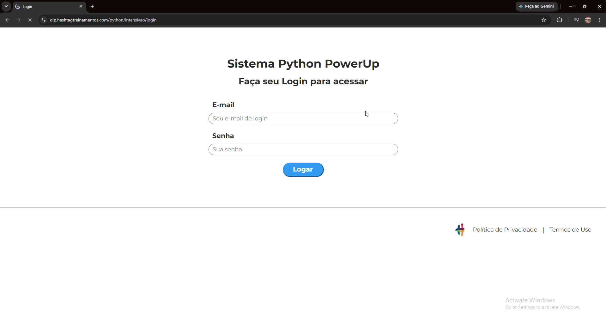

# 🤖 Automação de Cadastro de Produtos com Python e PyAutoGUI

Projeto desenvolvido durante a **Jornada Python** da Hashtag Treinamentos. É uma automação de processos (*RPA — Robotic Process Automation*, em português "Automação Robótica de Processos") que lê uma base de produtos em um arquivo `.csv` e cadastra cada item, automaticamente, em um sistema web.

---

## 📌 Visão Geral do Projeto



O script executa os seguintes passos:
1. Abre o navegador Chrome e acessa a página de login do sistema.
2. Faz o login com e-mail e senha.
3. Lê a base de dados `produtos.csv` usando a biblioteca **Pandas**.
4. Percorre a tabela linha por linha e preenche os campos do formulário (Código, Marca, Tipo, Categoria, Preço, Custo e Observações).
5. Envia o formulário e repete o processo até acabar a lista de produtos.

> **Nota:** o sistema usado é um ambiente de treino do curso. O login aceita qualquer e-mail e senha, por isso não há credenciais reais neste repositório.

---

## 🛠️ Tecnologias Utilizadas

* **[Python](https://www.python.org/)** — Linguagem principal do projeto.
* **[PyAutoGUI](https://pyautogui.readthedocs.io/)** — Automação de mouse e teclado.
* **[Pandas](https://pandas.pydata.org/)** — Leitura e manipulação da base de dados `.csv`.
* **[Time](https://docs.python.org/3/library/time.html)** — Biblioteca padrão do Python, usada para fazer pausas e esperar as telas carregarem.

---

## 📁 Estrutura do Projeto

```text
automacao-processos-python/
├── assets/            # Imagens e GIF de demonstração
├── .gitignore         # Arquivos que o Git deve ignorar
├── main.py            # Script principal da automação
├── produtos.csv       # Base de dados dos produtos a cadastrar
├── README.md          # Documentação do projeto
└── requirements.txt   # Lista de dependências
```

---

## ⚙️ Configuração do Ambiente e Execução

### 1. Pré-requisitos
Ter o Python 3 instalado na máquina.

### 2. Clonar o repositório
```bash
git clone https://github.com/David-Axe/automacao-processos-python.git
cd automacao-processos-python
```

### 3. Instalar as dependências
Instale as bibliotecas listadas no arquivo `requirements.txt`:
```bash
pip install -r requirements.txt
```

### 4. Executar o script
O arquivo `produtos.csv` deve ficar na mesma pasta do `main.py`.
```bash
python main.py
```

---

## ⚠️ Observações Técnicas e Trava de Segurança

* **Resolução de tela e coordenadas:** o `PyAutoGUI` clica em posições da tela (coordenadas x, y). Por isso, o projeto foi configurado e testado em uma resolução específica. Em uma tela com resolução diferente, é preciso recalibrar as coordenadas no `main.py`.
* **Trava de segurança (*fail-safe*, "à prova de falha"):** o `PyAutoGUI` já vem com esse mecanismo ativo. Para interromper a automação a qualquer momento, **mova o ponteiro do mouse rapidamente para o canto superior esquerdo da tela**.

---

## 👨‍💻 Autor

Desenvolvido por **Davi Leonardo Machado** durante os estudos de Python e automação.
Fique à vontade para entrar em contato e enviar sugestões!